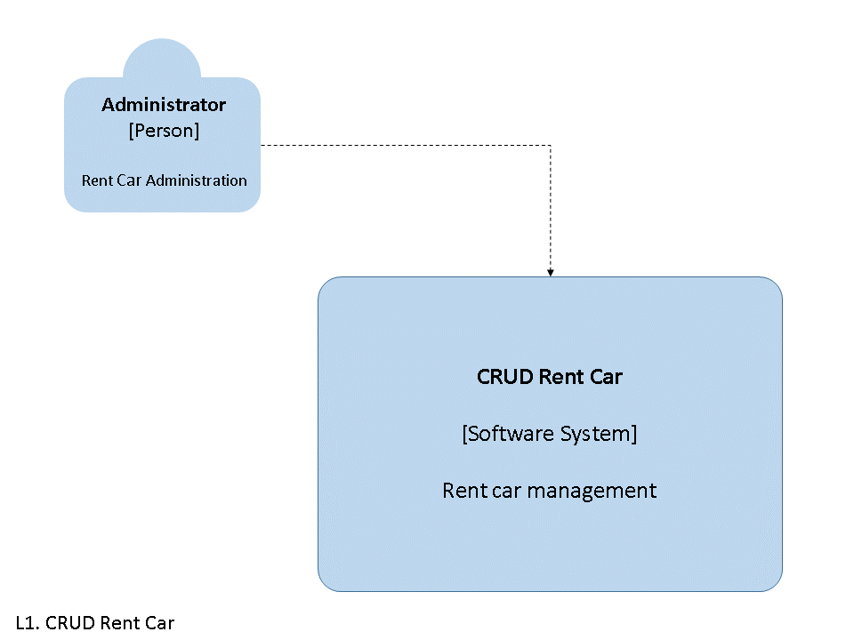

# DriveHubRentals

# Final Project - DriveHubRentals

## Description

This repository contains my final course project for r/argentina programa. The project involves a car rental system with CRUD (Create, Read, Update, Delete) operations. The system's structure is documented using a C4 diagram, which is provided below.

## Technologies Used

- **Backend:**
  - []
- **Database:**
  - []

## C4 Diagram

### Level 1 (L1): System Context



### Level 2 (L2): Containers


### Level 3 (L3): Components


## Getting Started

If you want to run this project locally, follow these steps:
...
...
...

1. **Clone the Repository:**
   ```bash
   git clone https://github.com/Nahuel-Salvatierra/DriveHubRentals.git
   cd DriveHubRentals
